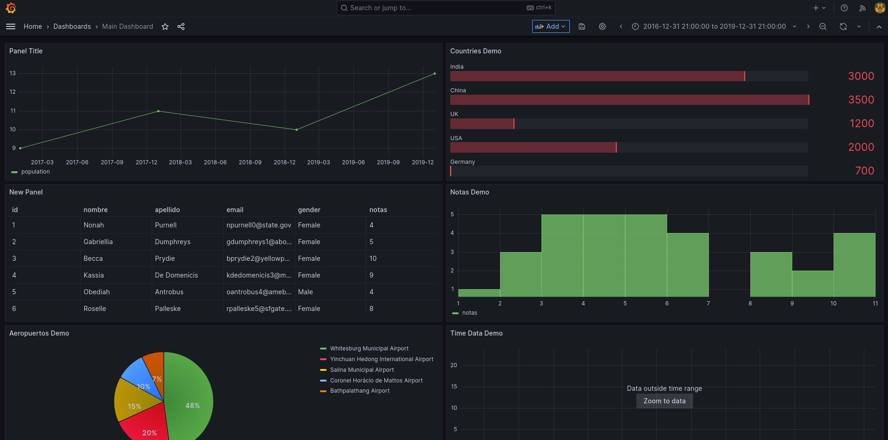

## Introducción

En el año 2020, la infección por el virus COVID-19 es declarado pandemia por la OMS. Nuestro país no es ajeno a la situación y comienzan a aumentar los casos.
CABA, una de las provincias con mayor cantidad de población, fue una de las más afectadas en cantidad de contagios. Nos enfocaremos en analizar el número de infectados en los distintos barrios de la Ciudad.

## Objetivo
Apuntamos a realizar una comparativa de la cantidad de casos de COVID-19 en el año 2020 y 2023. Nos enfocaremos en mostrar la evolución de los casos en los distintos barrios de CABA a través del tiempo. Algunos datos para destacar en la investigación:

- Casos positivos
- Muertes
- Cantidad de casos por barrio / comuna
- Cantidad de casos por mes
- Promedio de edad de infectados
- Porcentaje de casos por género

## Metodología

Utilizaremos [Tableau](https://www.tableau.com/es-es) para el análisis de datos y gráficos. ~~Todo esto se verá plasmado [en una landing page (work in progress)](https://kaenovsky.github.io/enigma-dss/src/).~~

~~En una siguiente etapa (TP N°3), vamos a permitir al usuario interactuar con la información del dataset a través de una instancia de [Grafana](https://grafana.com/) corriendo en un servidor web.~~

 🚀 Update: Quedó corriendo una primera versión demo en una VPS (Digital Ocean). Utilizando ngnix y configurando los DNS desde el manager de DO para tener distintos subdominios, dejamos seteada la siguiente configuración:

- Landing page general: https://altadata.ar
- Landing page covid: https://covid.altadata.ar
- Instancia grafana: https://graf.altadata.ar (con docker 🐳)

---

últimos checkpoints vistos en clase:

[✅] Permitir visualización sin login

[✅] Agregar TSL/SSL para https

[✅] Permitir Sing Up / Sign in

[❌] Mejorar dashboard de datos

[❌] Mejorar propuesta 

(idea nueva 💡 permitir al usuario hacer su panel)

Para eso necesitamos un mini tutorial, datos de prueba y dar permisos de edición a los dasboards.

[✅] Permitir Sing Up / Sign in

---

### Primera parte (del TP1)

Esto está relacionado a la landing que quedó subida en https://covid.altadata.ar

Dataset elegido: Datos COVID.

Link de datos abiertos: https://data.buenosaires.gob.ar/dataset/casos-covid-19